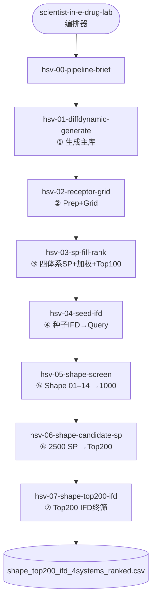

# E-Drug Lab Scientist — Skill 工作流地图

科学家推进 HSV Pol（或换口袋复刻）时，**每个方框 = 一个 skill**。

## 并行可调用的工具型 skills（不替代环节）

| 需要时 | 可搭配 |
|--------|--------|
| 化学结构 / 指纹 | `rdkit-2`, `chemistry-query-2` |
| 已知活性对照 | `active-ligands`, `pocket-comparison` |
| 单点对接冒烟 | `molecular-docking-autodock-2` / `sz.glide_sp` |
| 文献 | `academic-search`, `nature-academic-search` |
| 画图 / 论文 | `nature-figure`, `diffdynamic-paper-plots-2` |

## 硬约束（所有 hsv-* 共享）

- 四体系：`WT / N815S / W781V / Y941H`
- 加权：`0.5×pct(WT) + ⅙×pct(各突变)`
- 主键：`molecule_id` / `library_id` / `QUERY_*` — **禁止 SMILES join**
- IFD 配体残基：**Z:1000**（不是 Z:999）
- 大任务：冒烟通过 + 用户下令后再全量

## 权威文档

- 画图总览：`hsvpol/FULL_PIPELINE_FLOWCHART.md`
- 换口袋手册：`hsvpol/PIPELINE_NEXT_POCKET_HANDBOOK.md`
- 平台 catalog：`config/platform/catalog.yaml`
