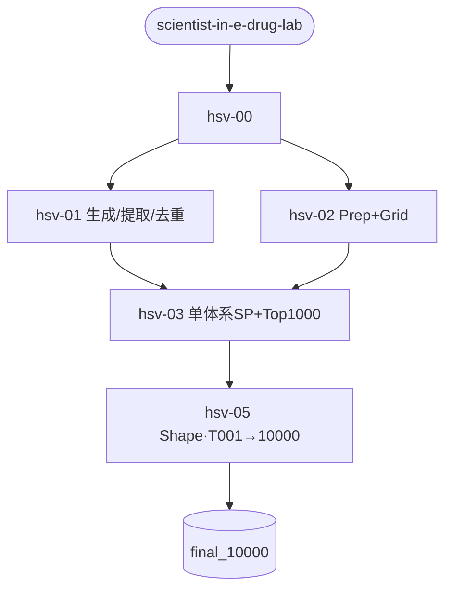

# WORKFLOW — 8G9V / TargetMol T001（单体系任务）

> 与默认 [WORKFLOW.md](WORKFLOW.md)（HSV 四突变全漏斗）并列。  
> 画图全文：`/home/user/Desktop/Ye/DiffDynamic/hsvpol/targetmol_t001/docs/8G9V_SCIENTIST_PIPELINE_FLOWCHART.md`

## 本任务路由（调用 / 跳过）

```text
hsv-00 → hsv-01 → hsv-02 → hsv-03 → hsv-05
              ↘ 跳过 hsv-04 / hsv-06 / hsv-07
```

| Skill | 本任务 |
|-------|--------|
| `scientist-in-e-drug-lab` | 编排 |
| `hsv-00-pipeline-brief` | 锁 8G9V、50k、单体系、禁 IFD、库=T001 |
| `hsv-01-diffdynamic-generate` | Prudent 生成 + novina + 去重 |
| `hsv-02-receptor-grid` | Prep + 单体系 Grid |
| `hsv-03-sp-fill-rank` | 单体系 SP + Top1000（非四体系加权） |
| `hsv-04-seed-ifd` | **不调用**（query=SP pose） |
| `hsv-05-shape-screen` | Shape；**库=TargetMol T001**，终库 10000 |
| `hsv-06` / `hsv-07` | **不调用** |


