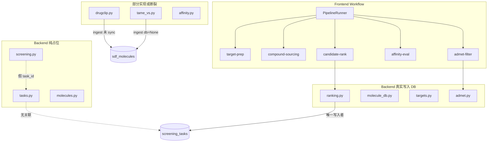

# e-drug-lab 流水线代码审查报告

> **审查日期**：2026-06-12  
> **审查范围**：虚拟筛选五步 workflow 端到端——后端路由/服务/DB/Worker、前端 workflow 页面与 API Client、数据库 schema 对齐、DrugCLIP/TAME-VS 集成  
> **审查视角**：纯代码层面（功能完整性、契约一致性、数据流、安全与可维护性）  
> **本报告不包含**：科学算法参数调优细节（见 [`docs/CODE_REVIEW.md`](CODE_REVIEW.md)）；单次 working-tree diff 审查（见根目录 [`CODE_REVIEW.md`](../CODE_REVIEW.md)）

---

## 一、审查范围与方法

### 1.1 覆盖模块

| 层级 | 路径 | 审查重点 |
|------|------|----------|
| 后端入口 | `backend/app/main.py`, `config.py`, `db.py` | 启动、DB 初始化、路由注册、就绪探针 |
| 后端路由 | `backend/app/api/routes/` | screening、tasks、admet、affinity、drugclip、tame_vs、ranking、targets、libraries、molecule_db |
| 后端服务 | `backend/app/services/` | admet、vina、drugclip_docker、tame_vs_docker、orthogonal_scoring、sdf_sync |
| 数据层 | `backend/app/repositories/models.py`, `database/init.sql`, `backend/alembic/` | ORM / SQL / 迁移一致性 |
| Worker | `backend/app/workers/` | Celery 配置与 docking worker |
| 前端 workflow | `frontend/src/app/workflow/*`, `frontend/src/components/workflow/` | 五步页面、PipelineRunner、WorkflowLayout |
| API 契约 | `frontend/src/lib/api-client.ts`, `frontend/src/lib/models-config.ts` | 前后端路径与语义对齐 |
| 交付物集成 | `deliverables/drugclip-package/` | Docker 服务与后端对接 |

### 1.2 审查方法

1. 静态阅读源码，对照前后端 API 路径与请求/响应结构  
2. 追踪 pipeline 数据流：靶点 → 化合物库 → ADMET → 对接 → 正交排序  
3. 比对 ORM、`init.sql`、Alembic 三套 schema 定义  
4. 识别 stub/占位实现与 UI 标注 `implemented` 的差异  

### 1.3 与既有审查文档的关系

| 文档 | 侧重点 | 本报告是否重复 |
|------|--------|----------------|
| [`docs/CODE_REVIEW.md`](CODE_REVIEW.md) | 正交打分算法、SDF 解析、ADMET 科学语义 | 否——本报告仅引用其结论，不展开算法细节 |
| [`CODE_REVIEW.md`](../CODE_REVIEW.md) | 2026-06-06 working-tree diff（事件循环阻塞、docstring 过时等） | 部分重叠——本报告在 P1/P2 中合并相关项并标注来源 |

---

## 二、架构现状与数据流

### 2.1 预期流水线


### 2.2 实际代码接线状态



### 2.3 核心结论

五步 workflow UI 可跑通**演示路径**（尤其 One-Click Pipeline），但存在以下系统性问题：

1. **任务生命周期未贯通**：`screening` / `tasks` 路由返回随机 UUID，与 `screening_tasks` 表无关联；Celery worker 未被任何路由调用  
2. **外部工具结果未入库**：DrugCLIP / TAME-VS ingest 写 SDF 文件后未调用 `sync_sdf_library`  
3. **前端标注与实现不符**：多处 `status: "implemented"` 实际为属性估算或 health check  
4. **Schema 三方漂移**：ORM（8 表）、`init.sql`（10 表）、Alembic（仅 alter）不一致  
5. **Workflow 上下文断裂**：分步使用时 Step1 靶点未写入全局 context，Step5 拿不到 `target_id`  

---

## 三、问题清单（按优先级）

---

### P0 — 运行时错误与路径 / Schema 硬伤

#### P0-1 `AppError` 调用签名错误（运行时 TypeError）

| 项 | 内容 |
|----|------|
| **现象** | DrugCLIP 服务不可达或筛选失败时，异常处理分支会再次抛出 `TypeError` |
| **位置** | `backend/app/api/routes/drugclip.py` L85-88 |
| **根因** | 使用 `AppError(reason=..., status_code=...)`，但 `AppError.__init__` 要求 `message` + `code`（`backend/app/core/errors.py` L16-27） |
| **影响** | 用户收到 500 而非预期的 503/业务错误；错误信息不可读 |
| **修复方案** | 改为 `raise AppError(message=f"...", code="DRUGCLIP_UNAVAILABLE", status_code=503)` |

```python
# 当前（错误）
raise AppError(reason=f"DrugCLIP service unreachable: {exc}", status_code=503)

# 建议
raise AppError(
    message=f"DrugCLIP service unreachable: {exc}",
    code="DRUGCLIP_UNAVAILABLE",
    status_code=503,
)
```

---

#### P0-2 项目根路径解析不一致

| 模块 | 文件 | `parents[N]` | 解析到 | 应为 |
|------|------|--------------|--------|------|
| DrugCLIP 路由 | `drugclip.py` L133 | `parents[3]` | `backend/` | monorepo 根 |
| DrugCLIP 服务 | `drugclip_docker.py` L22 | `parents[2]` | `backend/` | monorepo 根 |
| 靶点 PDB 样本 | `targets.py` L119, L143 | `parents[3]` | `backend/` | monorepo 根 |
| TAME-VS 路由 | `tame_vs.py` L138 | `parents[4]` | monorepo 根 | 正确 |
| TAME-VS 服务 | `tame_vs_docker.py` L26 | `parents[3]` | `backend/app/` | 应为 monorepo 根 |

| 项 | 内容 |
|----|------|
| **影响** | 默认 `package_path="deliverables/drugclip-package"` 解析为 `backend/deliverables/...`（不存在）；SDF 输出落到 `backend/molecules/sdf/drugclip`；PDB 样本目录找不到 |
| **修复方案** | 1. 新增 `app/core/paths.py`，统一 `get_repo_root()`（以 `tame_vs.py` 的 `parents[4]` 为基准）<br>2. 全项目替换散落的 `parents[N]`<br>3. `DrugClipSettings.package_path` 支持绝对路径并在文档中说明 |

---

#### P0-3 Schema 三方漂移

**表级差异**

| 表名 | ORM (`models.py`) | `init.sql` | Alembic | 说明 |
|------|-------------------|------------|---------|------|
| `candidate_metric_values` | 无 | 有 | 无 | 仅 init.sql 存在，代码无 ORM、无写入 |
| `orthogonal_scores` | 无 | 有 | 无 | 同上 |
| 其余 8 表 | 有 | 有 | 仅改 PK 类型 | 列级仍有差异 |

**列级差异（ORM 有、init.sql 无）**

| 表 | 列 | 使用方 |
|----|-----|--------|
| `targets` | `name`, `status` | `targets.py` CRUD |
| `candidate_molecules` | `standard_name` | `ranking.py` 持久化 |
| `sdf_molecules` | `sa_score` | `molecule_db.py` 查询/过滤 |

**迁移与启动策略冲突**

| 机制 | 文件 | 问题 |
|------|------|------|
| `create_all()` | `main.py` L57 | 每次启动建表，不更新已有表列 |
| SQLite 补丁 | `db.py` L20-47 | 仅补 `sa_score`、`standard_name`；不补 `targets.name/status`；PostgreSQL 无补丁 |
| Alembic | `2aae692a3003_init.py` | 无 `create_table`；假设表已存在且 PK 为 `NUMERIC`；空库 `upgrade` 会失败 |

| 项 | 内容 |
|----|------|
| **影响** | 用 `init.sql` 建 PostgreSQL 库时路由查询缺列报错；用 Alembic 空库迁移失败；dev/prod schema 来源不统一 |
| **修复方案** | 1. 以 `models.py` 为单一真相源<br>2. 新建 Alembic revision：完整 `create_table` + 补列 migration<br>3. 同步更新 `init.sql`（补 ORM 列；删除或实现 `candidate_metric_values` / `orthogonal_scores`）<br>4. 生产禁用 `create_all`，统一走 Alembic<br>5. dev SQLite 扩展 `db.py` 补丁至 `targets.name/status` |

**设计决策（需产品确认）**

- **方案 A**：实现 `candidate_metric_values` / `orthogonal_scores` 的 ORM，ranking 写入规范化表（符合 init.sql 设计）  
- **方案 B**：从 `init.sql` 删除这两张表，继续将分数存入 `CandidateMolecule` 的 JSON 列（当前 `ranking.py` 做法）  

---

#### P0-4 Ingest 未同步分子库

| 项 | DrugCLIP | TAME-VS |
|----|----------|---------|
| **现象** | `ingest=True` 时只写 SDF 文件 | smoke/full-screen 调用 `ingest_result_csv(None, ...)` |
| **位置** | `drugclip.py` L62, L90-96；`drugclip_docker.py` import `sync_sdf_library` 未调用 | `tame_vs_docker.py` 内部 ingest 路径 |
| **根因** | 路由注入 `db: Session` 但未传给 ingest；`results_to_sdf()` 不触发 DB sync | 测试/筛选入口显式传 `db=None` |
| **影响** | 筛选结果不出现在 `sdf_molecules`，前端 `listMolecules` / pipeline 加载不到新分子 |
| **修复方案** | ingest 后统一调用 `sync_sdf_library(db, sdf_path, library_id)`；路由层传入真实 `Session` 与 `library_id` |

---

### P1 — Pipeline 功能断裂与契约不一致

#### P1-1 Screening / Tasks 纯占位

| 项 | 内容 |
|----|------|
| **现象** | `POST /screening/start` 返回随机 UUID；`GET /tasks/{id}` 返回硬编码状态；均不写 `screening_tasks` 表 |
| **位置** | `backend/app/api/routes/screening.py` L8-25；`tasks.py` |
| **对比** | 唯一写 `screening_tasks` 的路径：`ranking.py` 的 `_persist_ranking_run` |
| **影响** | 前端 `api-client` 已有 `startScreening` / `listTasks` 等方法，但接入后无法追踪真实任务 |
| **修复方案** | 1. `POST /screening/start` 创建 `ScreeningTask` 记录（status=queued）<br>2. 长任务通过 Celery 入队并更新 status/progress<br>3. `GET /tasks/{id}` 读 DB<br>4. 前端 PipelineRunner 可选绑定 `task_id` 轮询进度 |

---

#### P1-2 Celery 完全断开

| 项 | 内容 |
|----|------|
| **现象** | `docking_worker.py` 返回假 `completed`；全库无 `.delay()` 调用 |
| **位置** | `backend/app/workers/docking_worker.py` L12-14；`celery_app.py` |
| **影响** | 配置的 `celery__broker_url` 无实际作用；Vina/DrugCLIP 长任务阻塞 HTTP 或无法异步 |
| **修复方案** | 1. Vina batch、DrugCLIP screen、TAME-VS full-screen 入队<br>2. Worker 更新 `screening_tasks.status` 与 progress<br>3. `/ready` 可选检查 Redis 连通性 |

---

#### P1-3 前端「implemented」与实际 mock 不符

| 步骤 / 组件 | UI 标注 (`models-config.ts`) | 实际行为 |
|-------------|------------------------------|----------|
| compound-sourcing / SDF Upload | `implemented` | 仅 `createLibrary` + `syncMolecules`，**无文件上传** |
| compound-sourcing / DrugCLIP | `implemented` | 仅 `drugclipStatus()` health check，**不调用** `drugclipScreen` |
| affinity-eval / Vina | `implemented` | 仅 `vinaVersion()`；对接分数为属性公式估算 |
| PipelineRunner step4 | 显示 "Docking" | `property-estimate` 公式，非 `vinaDock` |
| PipelineRunner step2 drugclip | 可选 | 直接抛错 "not wired yet"（`PipelineRunner.tsx` L186-189） |
| PipelineRunner step3-5 | 下拉选择 `sel3/4/5` | **执行逻辑不读取**选择器 |
| candidate-rank | 注释写 "no random mock" | `getDockingScore` 无 vina 结果时用 `Math.random()`（`page.tsx` L44） |
| candidate-rank | pipeline 为空 | fallback `orthogonalDemo()` |

**属性估算代码（Step4 实际逻辑）**

```261:289:frontend/src/components/workflow/PipelineRunner.tsx
  const runStep4 = useCallback(async (pipeline: PipelineMolecule[]): Promise<PipelineMolecule[]> => {
    // ...
    const affinity = -(5.0 + (Math.abs(mw - 350) / 100) * 2 + (Math.abs(logp - 3) / 2) + tpsa / 50);
    const result = {
      // ...
      method: "property-estimate",
    };
```

| 修复方案 | 说明 |
|----------|------|
| **短期** | `models-config.ts` 将未接通项改为 `partial`/`stub`；UI 文案与 `method` 字段一致 |
| **中期** | 接通 `libraries/upload`、`drugclipScreen`、`vinaBatchDock` 或 `POST /api/v1/affinity/dock` |
| **PipelineRunner** | 读取 `sel3/4/5` 分支执行，或移除无效选择器避免误导 |

---

#### P1-4 API Client 与后端不匹配

| 类型 | 前端 | 后端 | 说明 |
|------|------|------|------|
| 不存在端点 | `optimizeAffinity` → `/api/v1/affinity/optimize` | 无 | `api-client.ts` L651-656，workflow 未调用但为隐患 |
| 后端有、前端无 | — | `POST /api/v1/affinity/dock` | 适合 pipeline 的简化对接 |
| 后端有、前端无 | — | `POST /api/v1/libraries/upload` | 真实 SDF 上传 |
| 后端有、前端无 | — | `GET /api/v1/admet/health`, `/properties` | ADMET 健康检查 |
| 语义不一致 | `downloadTarget` 后预处理 | `targets.py` download 只写文件 | **不更新** `Target.structure_path`（upload 会写） |
| 字段丢失 | `createLibrary` 传 `description` | `libraries.py` create 未持久化 `description` | 前端期望与 DB 不符 |

| 修复方案 | |
|----------|--|
| 删除或实现 `optimizeAffinity` | |
| 补充 `dockAffinity`、`uploadLibrary`、`admetHealth` 等 client 方法 | |
| `downloadTarget` 成功后更新 `Target.structure_path` | |

---

#### P1-5 Workflow 上下文断裂

| 项 | 内容 |
|----|------|
| **现象** | `target-prep/page.tsx` 靶点存本地 `useState`，未调用 `setTarget` 写入 WorkflowContext |
| **影响** | 用户分步操作时，Step5 ranking 拿不到 `target_id`/`pdb_id`（除非走 One-Click Pipeline 在 runner 内创建靶点） |
| **关联** | Step4 不使用 workflow `target` 做对接，即使有受体也无法真实 dock |
| **修复方案** | Step1 完成后 `setTarget`；Step4 读取 `target.structure_path` 调用 Vina；Step5 持久化时带上 `target_id` |

---

#### P1-6 异步阻塞与错误格式

| 问题 | 位置 | 影响 |
|------|------|------|
| ADMET `predict_batch` 同步阻塞 | `admet.py` 在 `async def` 中调用 | 大批量预测阻塞事件循环 |
| `urllib` 阻塞（部分已用 `to_thread`） | `drugclip.py` screen 已用 `asyncio.to_thread`；`targets.py` download 可能仍阻塞 | 长请求期间其他 API 无响应 |
| `validation_error_handler` 未注册 | `errors.py` 定义了处理器；`main.py` L107-108 仅注册 `AppError` + `Exception` | 422 响应格式与 RFC 9457 风格不一致 |
| 业务失败返回 HTTP 200 | `tame_vs` 部分路径、`targets.download` failed | 客户端易误判成功 |

| 修复方案 | |
|----------|--|
| ADMET 使用 `run_in_executor` 或改为同步路由 | |
| 网络 I/O 统一 `httpx.AsyncClient` 或 `asyncio.to_thread` | |
| 注册 `RequestValidationError` → `validation_error_handler` | |
| 失败场景返回 4xx/5xx 或统一 `{ ok: false }` 契约 | |

---

#### P1-7 Affinity 路由语义混淆

| 端点 | 注释/命名暗示 | 实际实现 |
|------|---------------|----------|
| `POST /affinity/dock` | 「先尝试 Vina」 | RDKit 属性经验公式，未调用 `tool_manager` |
| `POST /affinity/docking/glide` | Glide 对接 | 有 key 仍为 stub |
| `POST /affinity/mmgbsa`, `/md` | MM/GBSA / MD | 占位返回 |

| 修复方案 | |
|----------|--|
| 重命名 `/affinity/dock` 为 `/affinity/estimate` 或拆分 endpoint | |
| Stub 返回 HTTP 501 + `status: "not_implemented"` | |
| OpenAPI 描述与前端 `apiHint` 对齐 | |

---

### P2 — 安全、运维、测试与文档

#### P2-1 安全

| 问题 | 位置 | 严重性 | 修复方案 |
|------|------|--------|----------|
| 无 API 认证/授权 | 全部路由 | 高 | 后续加 API Key / JWT；敏感操作限内网 |
| 用户可控文件路径 | `affinity.py` receptor/ligand path | 高 | 路径白名单（`molecules/`、`outputs/`）；禁止 `..` |
| 用户路径发往 Docker | `drugclip.py` sdf_path、pocket_pdb_path | 高 | 路径校验 + compose 卷挂载 |
| PDB 下载 SSL 验证禁用 | `targets.py` | 中 | 恢复默认 SSL 验证 |
| 上传文件名未净化 | `targets.py` | 中 | 参考 `libraries.py` UUID 前缀命名 |
| 日志打印完整 `db_url` | `main.py` L58 | 中 | 脱敏（隐藏密码） |
| CORS `allow_credentials=True` | `main.py` L77-83 | 低-中 | 保持严格 `cors_origins_list` |

---

#### P2-2 配置与环境

| 问题 | 位置 | 修复方案 |
|------|------|----------|
| `.env.example` DrugCLIP 键名过时 | 写 `drugclip__api_key`，实际为 `service_url` 等 | 对齐 `config.py` 的 `DrugClipSettings` |
| `SDF_DIRECTORY` 未接入 Settings | `.env.example` 有变量，`Settings` 无字段 | 加入 `Settings` 或从 example 删除 |
| TAME-VS 默认端口与 FastAPI 冲突 | `config.py` 默认 `localhost:8000` | 改为独立端口（如 8501） |
| `admet__*` 未文档化 | `.env.example` 缺 ADMET 段 | 补充示例与说明 |
| `DatabaseSettings.pool_size` 未使用 | `config.py` 定义，`db.py` 未传入 `create_engine` | 配置连接池或删除无效字段 |

---

#### P2-3 测试缺口

**已有测试**

| 文件 | 覆盖 |
|------|------|
| `test_orthogonal_scoring.py` | 正交打分算法 |
| `test_ranking_naming.py` | 命名与 report 行构建 |
| `test_sdf_parser.py` | SDF 解析（依赖 monorepo 样本文件） |

**缺失测试**

- 所有 workflow 相关路由（screening、tasks、admet、affinity、drugclip、tame_vs、ranking API）  
- `vina_service`、`admet_service` 集成（mock subprocess）  
- `conftest.py` 无测试 DB fixture（仅改 `sys.path`）  
- Celery worker、schema 迁移一致性  
- 前端无 workflow E2E 测试  

| 修复方案 | |
|----------|--|
| `conftest.py` 增加 SQLite 内存库 + FastAPI TestClient | |
| 核心路由 smoke test；Docker/subprocess 用 mock | |
| schema 一致性测试：ORM metadata vs migration | |

---

#### P2-4 前端杂项

| 问题 | 位置 | 修复方案 |
|------|------|----------|
| 侧栏五步硬编码 `status: "stub"` | `WorkflowLayout.tsx` | 与 `models-config.ts` 统一单一数据源 |
| `health()`/`readiness()` 网络失败仍 `ok: true` | `api-client.ts` L391-393 | 失败时 `ok: false` |
| 前端误放 Python 占位文件 | `workflow/admet-filter/workers/*.py` | 删除或移至 backend |
| `PipelineRunner` 大量硬编码英文 | 未走 i18n | 接入 `translations.ts` |
| 双份步骤配置 | `models-config.ts` vs `WorkflowLayout.tsx` | 合并配置 |
| 未使用 state | `existingTargets`、`ligandsPrepared`、`library` 等 | 清理或接入 UI |

---

#### P2-5 DrugCLIP 容器集成

| 问题 | 说明 | 修复方案 |
|------|------|----------|
| compose 未挂载 `molecules/` | 宿主机路径原样 POST 给容器，容器内 `Path.exists()` 失败 | `docker-compose.yml` 增加数据卷；或路径转换层 |
| API 返回无 `smiles` | 容器返回 `name`+`score`；`results_to_sdf` 用 `name` 当 SMILES | 容器 API 补充 smiles；或后端用库内分子 ID 映射 |
| `integrations/drugclip.py` 未使用 | 路由直接用 urllib | 统一用 client 或删除死代码 |
| `.env.example` 与实现不一致 | 见 P2-2 | 更新文档 |

---

## 四、页面 → API 实际调用矩阵

| 页面 | 真实调用的 API | Mock / Stub / 未接通 |
|------|----------------|----------------------|
| `target-prep` | createTarget, downloadTarget, preprocessTarget, predict(占位) | AlphaFold 占位；未写入 workflow target；download 不更新 DB |
| `compound-sourcing` | createLibrary, syncMolecules, listMolecules, tameVs smoke, drugclip status | 无 upload；无 drugclip screen；过滤器静态展示 |
| `admet-filter` | filterAdmet, predictAdmet | —（本步相对最完整） |
| `affinity-eval` | vinaVersion, glideStatus, mmgbsa/md stub | vinaDock 未用；对接为属性估算 |
| `candidate-rank` | orthogonalRescore | pipeline 空时 demo；random docking fallback |
| `PipelineRunner` | 组合上述 API | step4 估算；drugclip 禁用；sel3-5 无效 |

---

## 五、建议修复路线图

### 阶段 1 — 可运行性（约 1–2 天）

**目标**：消除运行时错误与数据落库断裂

| 序号 | 任务 | 对应问题 |
|------|------|----------|
| 1.1 | 修复 `drugclip.py` 的 `AppError` 签名 | P0-1 |
| 1.2 | 统一 `get_repo_root()`，修正 drugclip/targets 路径 | P0-2 |
| 1.3 | DrugCLIP / TAME-VS ingest 后调用 `sync_sdf_library` | P0-4 |
| 1.4 | schema 最小对齐：补 `init.sql` 列或扩展 SQLite 补丁 | P0-3 |

### 阶段 2 — Pipeline 贯通（约 3–5 天）

**目标**：任务可追踪、前后端契约一致、workflow 数据流闭合

| 序号 | 任务 | 对应问题 |
|------|------|----------|
| 2.1 | `ScreeningTask` 生命周期 + Celery 骨架 | P1-1, P1-2 |
| 2.2 | 前端接通 upload / Vina / DrugCLIP，或诚实标注 stub | P1-3 |
| 2.3 | WorkflowContext 贯通 target；Step4 使用真实受体 | P1-5 |
| 2.4 | 对齐 api-client：删死端点、补缺失方法 | P1-4 |
| 2.5 | ADMET/网络 I/O 异步化；注册 validation handler | P1-6 |
| 2.6 | Affinity 端点语义澄清 | P1-7 |

### 阶段 3 — 质量与安全（持续）

**目标**：可部署、可测试、可审计

| 序号 | 任务 | 对应问题 |
|------|------|----------|
| 3.1 | 路径白名单、SSL、日志脱敏 | P2-1 |
| 3.2 | `.env.example` 与 config 对齐 | P2-2 |
| 3.3 | TestClient + 路由 smoke test；Alembic 规范化 | P2-3, P0-3 |
| 3.4 | 前端配置统一、i18n、清理占位文件 | P2-4 |
| 3.5 | DrugCLIP compose 卷与 API 契约 | P2-5 |

---

## 六、附录：关键文件索引

| 路径 | 说明 |
|------|------|
| `backend/app/main.py` | FastAPI 入口、`create_all`、路由注册、`/ready` |
| `backend/app/db.py` | SQLite 启动补丁、`get_db` |
| `backend/app/repositories/models.py` | ORM 定义（8 表） |
| `database/init.sql` | PostgreSQL bootstrap（10 表） |
| `backend/alembic/versions/2aae692a3003_init.py` | 不完整迁移 |
| `backend/app/api/routes/screening.py` | 筛选占位 |
| `backend/app/api/routes/drugclip.py` | DrugCLIP 路由（含 P0-1 bug） |
| `backend/app/services/drugclip_docker.py` | Docker 集成与 ingest |
| `backend/app/api/routes/ranking.py` | 唯一写 `screening_tasks` 的路径 |
| `backend/app/workers/docking_worker.py` | Celery stub |
| `frontend/src/lib/api-client.ts` | 前端 API 契约 |
| `frontend/src/lib/models-config.ts` | 步骤与模型状态配置 |
| `frontend/src/components/workflow/PipelineRunner.tsx` | One-Click 流水线 |
| `deliverables/drugclip-package/docker-compose.yml` | DrugCLIP 容器配置 |

---

*本报告仅记录代码审查结论与修复建议，不包含任何代码修改。实施修复时请按阶段推进，并同步更新本报告中的状态。*
